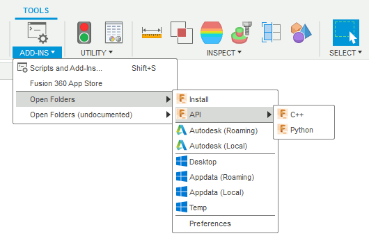
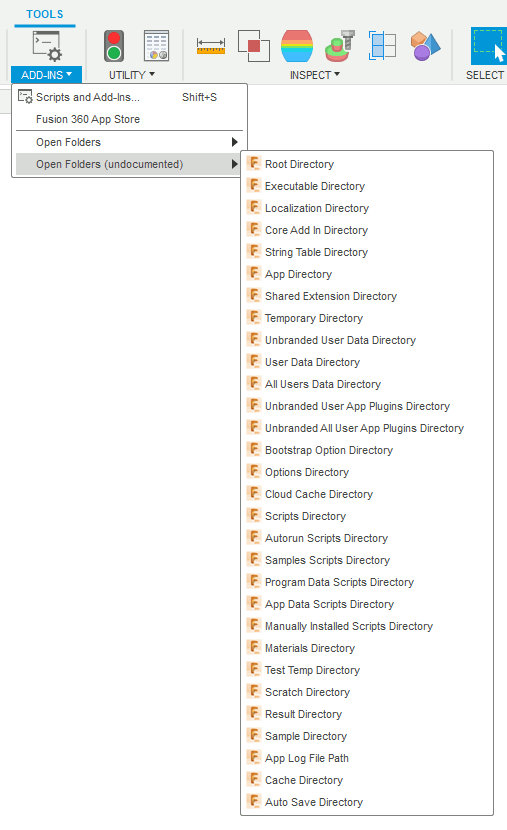
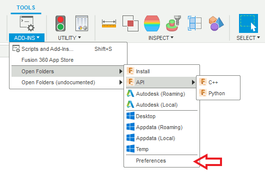
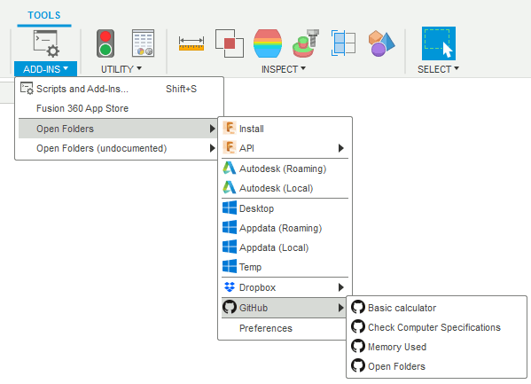
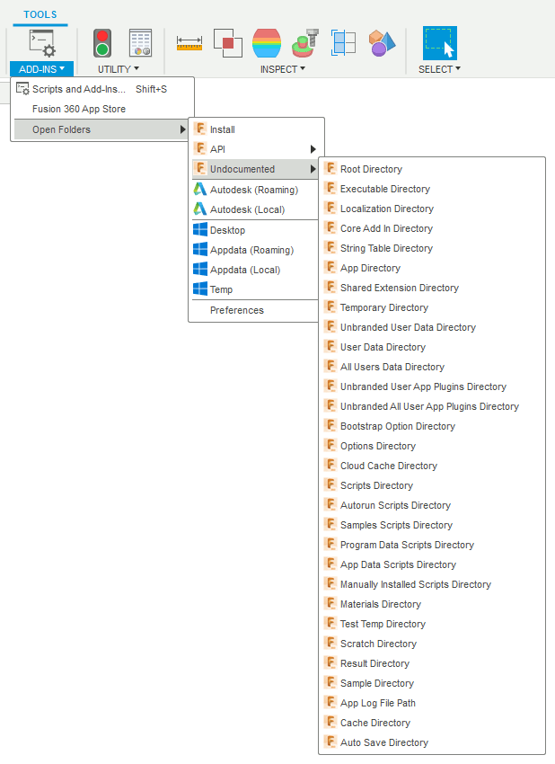

# Fusion 360 Open folders
Open folders in Windows Explorer or in MacOS Finder directly from the Fusion 360 UI





## Version history

- 0.3.0 (12 April 2021) - Fix a bug in "undocumentedControls" dict initialization
- 0.2.0 (12 April 2021) - Fix a bug in "controls" dict initialization
- 0.1.0 (02 April 2021) - First release

## Installation

Download and install the **GitHub2Fusion360** add-in ([Windows](https://apps.autodesk.com/FUSION/fr/Detail/Index?id=789800822168335025&appLang=en&os=Win64) or [Mac](https://apps.autodesk.com/FUSION/fr/Detail/Index?id=789800822168335025&os=Mac&appLang=en)) available for free on the Autodesk App Store.

Run the **GitHub2Fusion360** add-in in Fusion 360 and copy/paste the URL of the repo: [https://github.com/JeromeBriot/fusion360-open-folders](https://github.com/JeromeBriot/fusion360-open-folders)

## Usage

Run the **OpenFolders** add-in and you should see a new dropdown under the ADD-INS menu. Select an item to open it in Windows Explorer or MacOS Finder.

## Customization

You can add our own entries to the menu. To do so, click on the Preferences entry and edit the JSON file **customPaths.json**:



Parameters are:
* titles: the label that appears in the menu
* ids : a unique ID that identify the entry
* parentsIds : the ID of the parent entry if the current entry is under a dropdown or 'root' if the entry is under the main dropdown
* types: 'command' if the entry is a command or 'dropdown if the entry is a dropdown
* paths: the path to the folder to open when the entry is selected. Must be null if the entry is a dropdown.
* separators : boolean set to true if a separator must be added below the current entry
* icons: name of the icon to place next to the label of the entry or '' if no icon. Available icons are:
    * autodesk
    * dropbox
    * fusion360
    * github
    * gitlab
    * googledrive
    * macos
    * onedrive
    * windows

Here is an example of a customized JSON file that add Dropbox and GitHub entries:
```json
{
	"titles": [
		"Dropbox",
		"Fusion 360",
		"Scripts",
		"Add-Ins",
		"GitHub",
		"Basic calculator",
		"Check Computer Specifications",
		"Memory Used",
		"Open Folders"
	],
	"ids": [
		"Dropbox",
		"DropboxFusion360",
		"DropboxScript",
		"DropboxAddIns",
		"GitHub",
		"GitHubBasicCalculator",
		"GitHubCheckComputerSpecifications",
		"GitHubMemoryUsed",
		"GitHubOpenFolders"
	],
	"parentsIds": [
		"root",
		"Dropbox",
		"Dropbox",
		"Dropbox",
		"root",
		"GitHub",
		"GitHub",
		"GitHub",
		"GitHub"
	],
	"types": [
		"dropdown",
		"command",
		"command",
		"command",
		"dropdown",
		"command",
		"command",
		"command",
		"command"
	],
	"paths": [
		null,
		"C:\\Users\\******\\Dropbox\\dev\\fusion",
		"C:\\Users\\******\\Dropbox\\dev\\fusion\\scripts",
		"C:\\Users\\******\\Dropbox\\dev\\fusion\\addins",
		null,
		"D:\\github\\JeromeBriot\\fusion360-basic-calculator",
		"D:\\github\\JeromeBriot\\fusion360-check-computer-specifications",
		"D:\\github\\JeromeBriot\\fusion360-memory-used",
		"D:\\github\\JeromeBriot\\fusion360-open-folders"
	],
	"separators": [
		true,
		false,
		false,
		false,
		true,
		false,
		false,
		false,
		false
	],
	"icons": [
		"dropbox",
		"dropbox",
		"dropbox",
		"dropbox",
		"github",
		"github",
		"github",
		"github",
		"github"
	]
}
```

The result:



## Limitation

Due to a bug with nested dropdowns in Fusion 360, I had to create a second menu for the undocumented commands. As soons as this bug is fixed, the undocumented entries will be added to the offical ones:



More info about the bug: [[API BUG] Cannot click menu items in nested dropdown](https://forums.autodesk.com/t5/fusion-360-api-and-scripts/api-bug-cannot-click-menu-items-in-nested-dropdown/m-p/9669144#M10876)

## Acknowledgement
I added the undocumented feature as sugggested by Makoto Tanaka ([kandennti](https://forums.autodesk.com/t5/user/viewprofilepage/user-id/3787950)) on the [Fusion 360 API forum](https://forums.autodesk.com/t5/fusion-360-api-and-scripts/color-effect-for-head-up-display/m-p/10203555/highlight/true#M12997) :+1:.

## Licence

Codes are licensed under the terms of the MIT License.